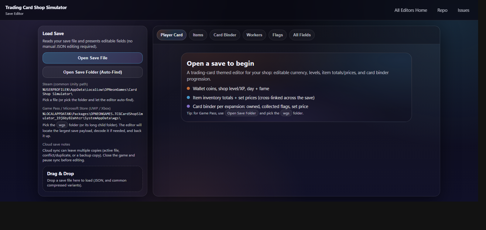

# Trading Card Shop Simulator (Game Preview) - Save Editor

A save editor for `Trading Card Shop Simulator (Game Preview)` that runs locally in your browser (GitHub Pages) and helps you edit key values without hand-editing JSON.

Use editor without downloading [HERE](https://saveeditors.github.io/trading-card-simulator-save-editor/)

All editors homepage: [`https://saveeditors.github.io/`](https://saveeditors.github.io/)

Have a request for a new save editor? [Request it here!](https://whispermeter.com/message-box/15b6ac70-9113-4e9c-b629-423f335c7e07)

## What You Can Edit Right Now

- Wallet currency: coins (keeps the duplicated coin fields in sync).
- Shop progression: day, shop level, and shop XP.
- Fame progression: fame points and total fame added.
- Shop state: open/closed flags, warehouse unlock toggle, room counters.
- Items (index-based): totals + set prices + market price view (cross-linked across the save).
- Card binder (per expansion): owned count, collected flag, set price, market price view.
- Unlock arrays: item licenses, workers hired, achievements.
- Worker multipliers: item/card price multiplier fields (positions/rotations are intentionally not exposed here).
- All Fields explorer: edit any value via UI controls (riskier ID/state fields are locked until Advanced Edits is enabled).

## Not Confirmed / Not Exposed Yet

- Card names, rarity labels, and item names are not shipped in this repo yet (to avoid bundling proprietary game data). The editor currently uses save indices.
- Layout/object placement editing (positions/rotations/object types) is not exposed as a friendly UI yet; it is only accessible via the All Fields explorer (Advanced Edits required).
- If your Steam build uses a different save format (compressed/encrypted), this editor will attempt to decode common JSON wrappers (gzip/deflate/base64), but unknown encodings are not yet supported.

## Quick Start (PowerShell)

Run from this folder:

- Web mode: `./Start-TradingCardSimulatorSaveEditor.ps1 -Port 8799`

Options:

- Change port: `./Start-TradingCardSimulatorSaveEditor.ps1 -Port 9000`
- Do not auto-open browser: `./Start-TradingCardSimulatorSaveEditor.ps1 -Port 8799 -NoOpen`

## Save Paths (Windows)

- Steam (common Unity path): `%USERPROFILE%\\AppData\\LocalLow\\OPNeonGames\\Card Shop Simulator\\`
- Game Pass / Microsoft Store (UWP / Xbox): `%LOCALAPPDATA%\\Packages\\OPNEONGAMES.TCGCardShopSimulator_19j6by82ahhzr\\SystemAppData\\wgs\\`

## Notes

- Close the game before editing, and pause/disable cloud sync while you work.
- For Game Pass/WGS, there may be multiple container folders (active vs conflict/duplicate). Use the newest/active one.
- This editor creates a backup on load (when enabled) and can also create a backup on save.
- Folder load + write-back works best in Chrome/Edge (File System Access API). Other browsers still support file open + download.
